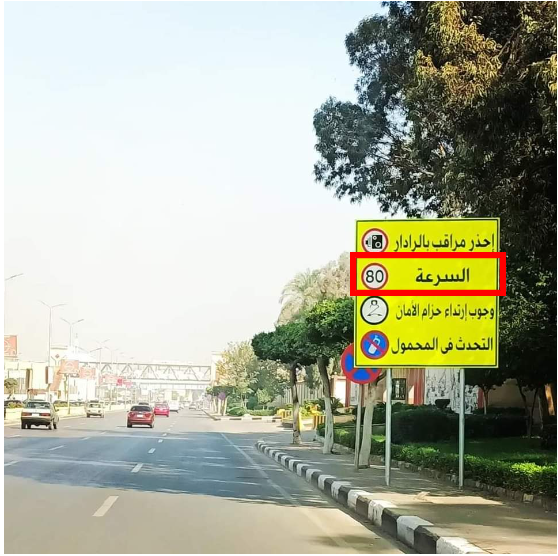
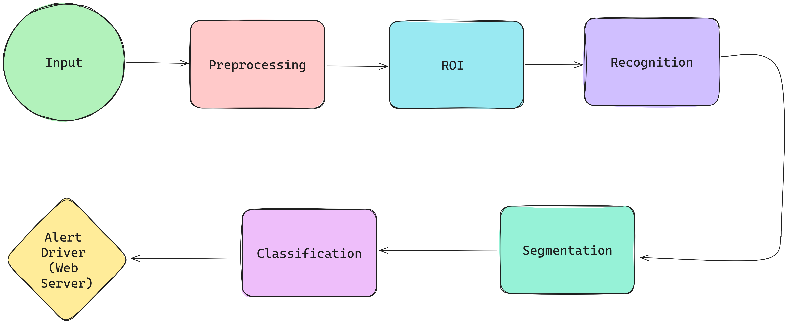

# Hdy 3sahn T3dy

## INTRODUCTION (Project Idea and Need)
The application is designed to scan the road using a mobile camera, identify speed road signs, and alert the driver about them.

## Block Diagram

## Block Explanation
### Input
The project handles 2 cases:
- Recorded Video (for testing) and url is video path (app\flask-server\videoread.py).
- Live Video (main function) From mobile phone and url is mobile ip-address.

Both are implemented using VideoCapture Function from OpenCV.
### Pre-processing
- Edge Detection using LOG (Laplace of gaussian)
- Apply histogram-equalization	
### Detection
Determine ROIs By selecting Contours That exceed the least minimum area (500), using cv2.findcontours() and cv2.contourarea().
### Recognition
Perform cross-correlation matrix similarity test to all given ROIs so we can choose only 1 of them per frame as follows:

We have a list of images called corr_images which are images of standard speed signs (30,40,50,60,70,80,100,120) . Each sign compares its correlation matrix (euclidean distance) with all ROIs and picks the nearest one.

### Segmentation:
Using the selected ROI we perform adaptive (gaussian) thresholding 
Then using connected components labeling and analysis we select contours with following properties:
- Aspect_ratio < 1
- 0.4 < Contour Height / ROI Height > 0.9
- contourArea / Bounding Box Area > 0.2

### Classification
#### Dataset used to train a classifier: <a href="https://www.kaggle.com/datasets/preatcher/standard-fonts-digit-dataset-09" >  Standard Fonts Digit Dataset (0-9) </a>     
Classification is done by the following steps:

- Applying resizing for each image to (16x32).
- Extract HOG feature.
- Train classifier on extracted feature vector for each speed
- Use pickle library to save the training of the model in a .pk1 file.

### Web-Server
A React.js Implemented web-server that is connected to sign recognition code where it takes captured image, video or real time video from camera then sends the input to recognition code and receives its output and notify the user with the speed limit.

## Initialization

## Papers & References:
- <a href= "https://www.sciencedirect.com/science/article/pii/S1474667016416009"> Traffic sign recognition application based on image processing techniques - ScienceDirect </a>

- <a href= "https://towardsdatascience.com/scanned-digits-recognition-using-k-nearest-neighbor-k-nn-d1a1528f0dea">Scanned Numbers Recognition using k-Nearest Neighbor (k-NN) | by Hussein Moghnieh, Ph.D. | Towards Data Science </a>

